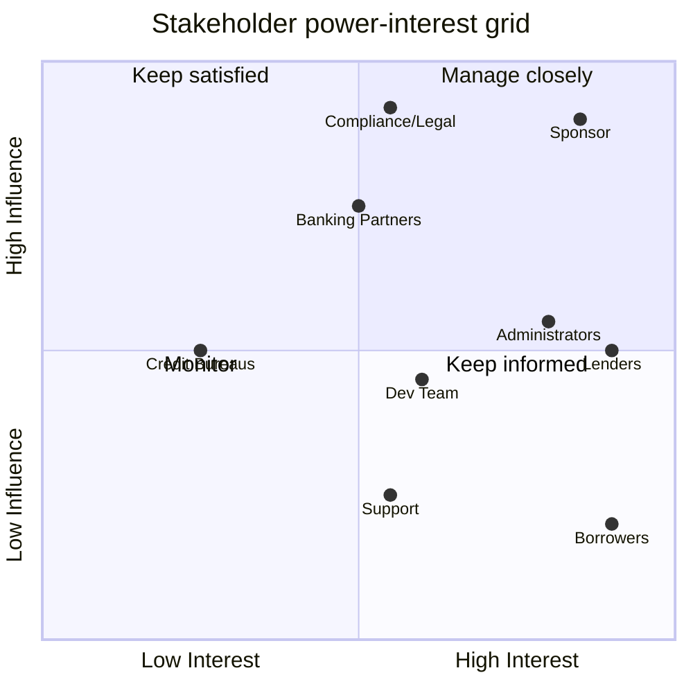

# 1. Stakeholder Analysis

[← Portfolio index](../README.md)

Before eliciting a single requirement, I identified who is affected by the platform, how much influence each group has over its success, and how each should be engaged. Getting this wrong is the most common cause of late-stage requirement churn: the person who could have told you the constraint in week one surfaces it in week ten.

## Stakeholder register

| Stakeholder | Category | Interest | Influence | What they need from the solution |
|---|---|---|---|---|
| Project Sponsor | Internal | High | High | Return on investment; regulatory exposure kept low |
| Borrowers | External / end user | High | Low | Fast access to affordable credit; clear terms; no hidden fees |
| Lenders / Investors | External / end user | High | Medium | Visible risk data; predictable returns; ability to decline |
| Platform Administrators | Internal / end user | High | Medium | Tools to vet users, monitor loans, act on problems |
| Compliance / Legal | Internal | Medium | **High** | CBN lending regulations; NDPR data protection; audit trail |
| Development Team | Internal | Medium | Medium | Unambiguous, testable requirements |
| Banking Partners | External | Medium | High | Secure integration; settlement reliability |
| Credit Bureaus | External | Low | Medium | Defined query interface; permissioned access |
| Customer Support | Internal | Medium | Low | Visibility of user state to resolve queries |

## Power / interest grid

## Engagement approach

| Group | Approach | Cadence |
|---|---|---|
| Manage closely — Sponsor, Administrators, Lenders | Workshops, prototype reviews, sign-off on each requirement set | Weekly |
| Keep satisfied — Compliance, Banking Partners | Targeted interviews; formal written review of anything touching regulation or settlement | At milestones |
| Keep informed — Borrowers, Support | Surveys, usability testing, contextual observation | At discovery and validation |
| Monitor — Credit Bureaus | Technical interface documentation only | As needed |

## Analysis note

**Compliance was the stakeholder most likely to be under-consulted and most able to stop the project.** Low day-to-day interest, very high influence — the classic "keep satisfied" trap. I scheduled Compliance review *before* solution design rather than after, because a lending regulation constraint discovered post-build is a redesign, not a change request.

The second observation: **borrowers have the highest interest and the least influence.** They cannot advocate for themselves in project governance, so their needs have to be represented deliberately through observation and usability testing rather than assumed from what internal stakeholders believe borrowers want.
