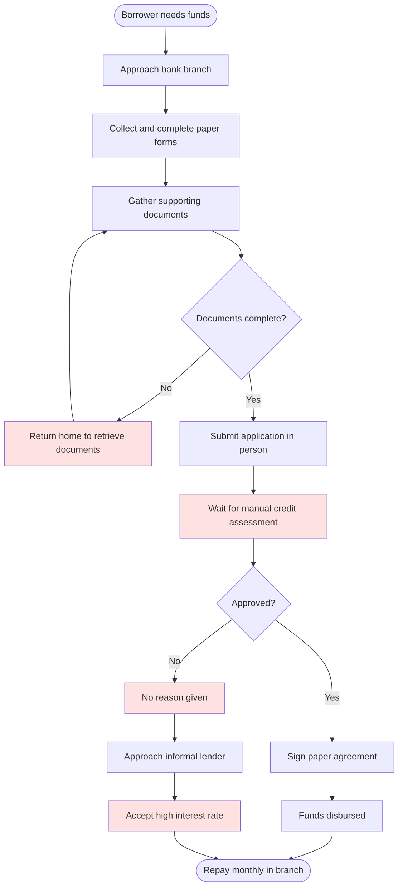
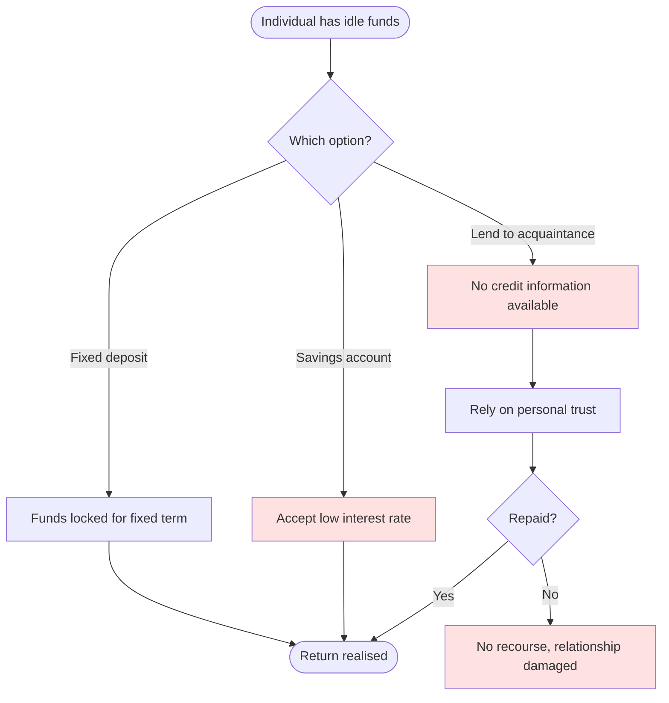

# 3. AS-IS Process Model

[← Portfolio index](../README.md)

How an individual currently obtains a personal loan, and how someone with idle savings currently seeks a return. Mapped from observation and interviews rather than from policy documents — including the workarounds people actually use.

## AS-IS: Borrower seeking credit

## AS-IS: Individual with funds to invest

## Pain points

| ID | Pain point | Affects | Evidence | Impact |
|---|---|---|---|---|
| P1 | Application requires multiple physical visits | Borrower | Observation | Abandonment before completion |
| P2 | Decision turnaround measured in weeks | Borrower | Interviews | Need has often passed by approval |
| P3 | Rejections give no reason | Borrower | Observation | Borrower cannot improve or self-select |
| P4 | Rejected borrowers turn to informal lenders | Borrower | Interviews | Punitive rates; debt spiral risk |
| P5 | No visibility of repayment obligation before commitment | Borrower | Observation | Commitments taken that cannot be serviced |
| P6 | Savings returns barely exceed inflation | Lender | Document analysis | Capital erodes in real terms |
| P7 | Private lending has no credit information | Lender | Interviews | Risk priced by guesswork |
| P8 | Private lending has no enforcement mechanism | Lender | Interviews | Losses absorbed personally |
| P9 | No structured record of either side's history | Both | Analysis | Good repayment behaviour earns no benefit |

## Analysis

The two processes are **mirror images of the same market failure**. Borrowers cannot access affordable capital; lenders cannot access borrowers with a measurable risk profile. Both parties want the same transaction, and the absence of trusted information — not the absence of money — is what prevents it.

This framing matters: it means the platform's core value is **information and trust infrastructure**, not lending. Every requirement that follows is tested against whether it closes an information gap between the two parties. That is the reasoning behind treating credit scoring as mandatory rather than a nice-to-have (finding F2).

→ Continues in the [TO-BE process model](04-to-be-process.md).
