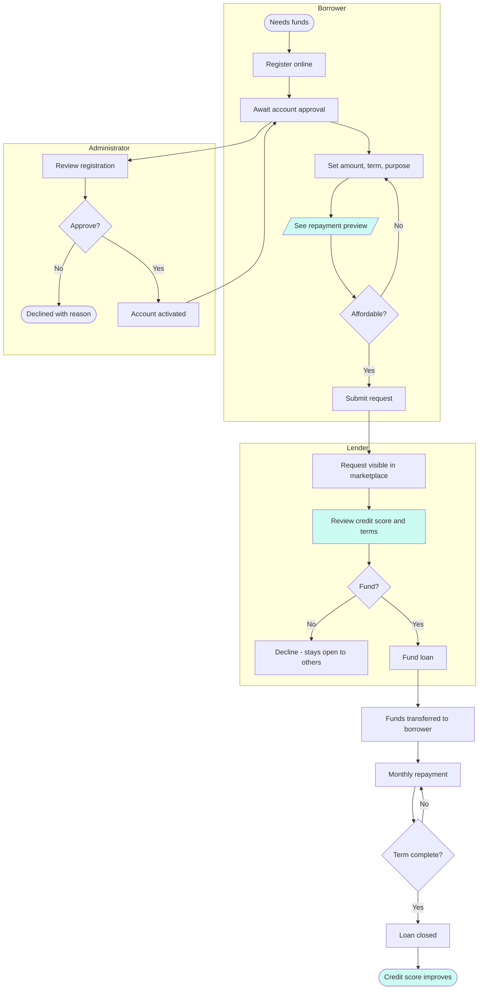
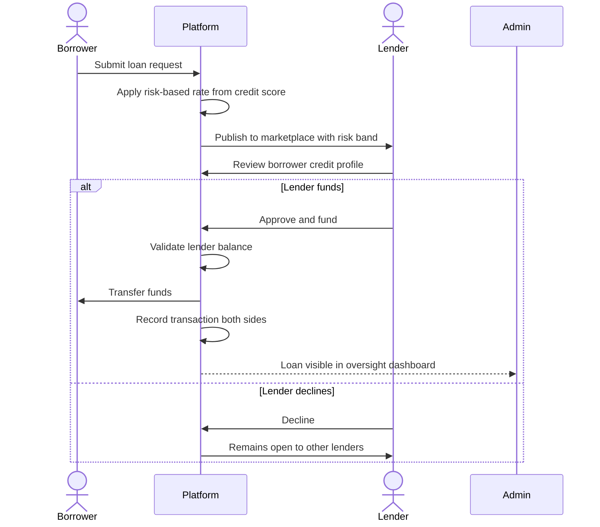

# 4. TO-BE Process Model

[← Portfolio index](../README.md)

The future-state process. Every change traces back to a specific pain point identified in the [AS-IS model](03-as-is-process.md) — no change is included because it seemed like a good idea.

## TO-BE: End-to-end loan lifecycle

## TO-BE: Swimlane view of the funding decision

## Changes and their justification

| Change | Resolves | How |
|---|---|---|
| Fully online application, single session | P1, P2 | Removes physical visits; decision in hours not weeks |
| Credit score visible to lender, risk band published | P7, P9 | Lender prices risk on data rather than guesswork |
| Risk-based interest rate | P3, P4 | Better credit earns a lower rate; borrower sees why |
| Repayment preview before submission | P5 | Borrower sees the monthly obligation before committing |
| Marketplace of multiple lenders | P4 | A decline by one lender is not a decline by the market |
| Structured transaction history | P9, P8 | Durable record; supports enforcement and future scoring |
| Credit score improves on full repayment | P9 | Good behaviour compounds into cheaper future credit |
| Platform returns exceed savings rates | P6 | Lender captures the spread banks previously took |

## Deliberate exclusions

Not everything that could be built should be. These were excluded from the target state with reasons recorded:

| Excluded | Reason |
|---|---|
| Automatic approval without admin review | Compliance requires human review of new accounts (finding F3) |
| Full financial history disclosure to lenders | Credit score satisfies the underlying need at lower NDPR exposure |
| Bad-loan recovery workflow | Out of charter scope; requires legal process design |
| In-platform messaging | Deferred — email suffices for MVP; adds moderation obligations |

## Measures of success

| Measure | AS-IS baseline | TO-BE target |
|---|---|---|
| Application to decision | 2–4 weeks | Under 48 hours |
| Application abandonment | High (observed) | Under 20% |
| Borrower knows repayment before committing | No | 100% |
| Lender has risk data before funding | No | 100% |
| Auditable record of money movement | Partial | Complete |
