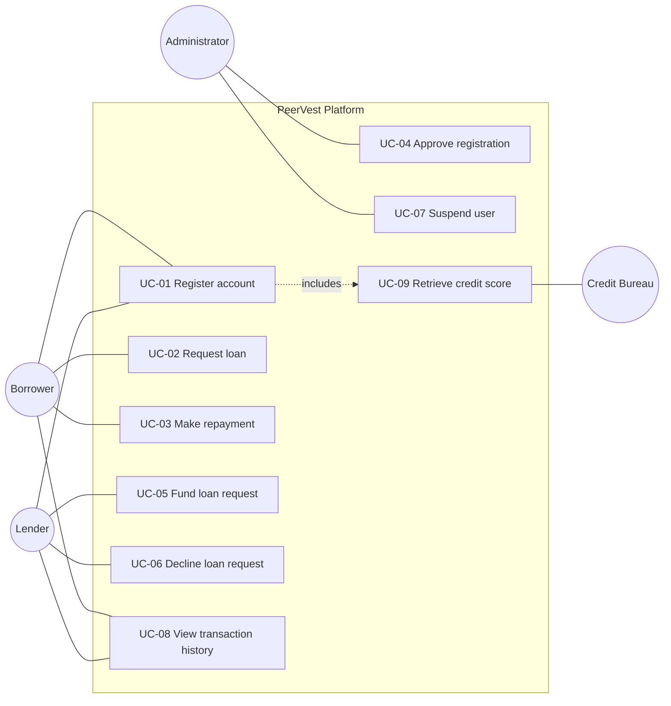

# 5. Use Case Diagram & Specifications

[← Portfolio index](../README.md)

Use cases were chosen over user stories alone for the core transactional flows because the **alternate and exception paths carry the business risk** — insufficient lender balance, a loan claimed by another lender, a suspended account mid-transaction. User stories tend to capture the happy path; use case specifications force the failure modes into the open.

The user stories used by the delivery team were derived from these specifications.

## Use case diagram

---

## UC-05: Fund a loan request

The highest-risk use case — it moves money between two parties.

| Field | Detail |
|---|---|
| **ID** | UC-05 |
| **Actor** | Lender (primary), Borrower (secondary) |
| **Goal** | Fund a borrower's loan request and begin earning interest |
| **Trigger** | Lender selects a pending request in the marketplace |
| **Preconditions** | Lender authenticated and account status = approved; loan status = pending; lender balance ≥ loan amount |
| **Postconditions (success)** | Loan status = active; funds moved lender → borrower; transaction recorded for both parties; request removed from marketplace |
| **Postconditions (failure)** | No state change; loan remains pending and available |

### Main flow

1. Lender opens the marketplace.
2. System displays pending requests with amount, term, purpose, borrower credit score, risk band, and projected interest return.
3. Lender selects a request and reviews the borrower's credit profile.
4. Lender chooses **Approve and fund**.
5. System validates that the loan is still pending.
6. System validates that the lender's available balance covers the loan amount.
7. System debits the lender's balance and credits the borrower's balance.
8. System sets loan status to active and records the funding date.
9. System writes a transaction record against both the lender and the borrower.
10. System confirms to the lender and removes the request from the marketplace.

### Alternate flows

**A1 — Lender declines instead of funding** (step 4)
The lender selects Decline. The system records the decline against that lender only; the request remains open to other lenders. *Rationale: a single decline must not remove a borrower's access to the whole market — pain point P4.*

**A2 — Lender partially funds** *(deferred to a future release)*
The lender commits less than the requested amount and the request remains open for the balance. Excluded from MVP; recorded here so the decision is visible rather than forgotten.

### Exception flows

**E1 — Insufficient lender balance** (step 6)
System halts, makes no state change, and informs the lender of the shortfall. Loan remains pending.

**E2 — Loan already funded by another lender** (step 5)
System informs the lender that the request is no longer available and refreshes the marketplace. *This is a genuine concurrency risk: two lenders can open the same request simultaneously. The status check must occur at the point of commitment, not at the point of display.*

**E3 — Lender account suspended between login and funding** (step 5)
System blocks the action and directs the lender to support.

**E4 — Transfer fails after debit** (step 7)
The transaction must be atomic — both sides succeed or neither does. A partial transfer that debits the lender without crediting the borrower is the most serious failure mode in the system.

### Business rules invoked

[BR-04](07-business-rules.md), [BR-05](07-business-rules.md), [BR-09](07-business-rules.md)

---

## UC-02: Request a loan

| Field | Detail |
|---|---|
| **ID** | UC-02 |
| **Actor** | Borrower |
| **Goal** | Obtain funds on terms the borrower can service |
| **Preconditions** | Borrower authenticated; account status = approved |
| **Postconditions** | Loan created with status = pending and visible in the marketplace |

### Main flow

1. Borrower opens the loan request form.
2. System displays the borrower's applicable interest rate, derived from their credit score.
3. Borrower enters amount, selects term, and states purpose.
4. System calculates and displays the monthly repayment and total repayable **before submission**.
5. Borrower submits.
6. System validates amount is within permitted limits.
7. System creates the loan with status pending and publishes it to the marketplace.

### Alternate flows

**A1 — Borrower adjusts after seeing the preview** (step 4)
The borrower changes the amount or term; the system recalculates live. *This is the direct remedy for pain point P5 and is the reason the preview appears before submission rather than on a confirmation screen.*

### Exception flows

**E1 — Amount outside permitted limits** (step 6) — request rejected with the permitted range stated.
**E2 — Account not yet approved** (precondition) — borrower is informed the account is under review.

### Business rules invoked

[BR-02](07-business-rules.md), [BR-03](07-business-rules.md), [BR-06](07-business-rules.md)

---

## UC-04: Approve a registration

| Field | Detail |
|---|---|
| **ID** | UC-04 |
| **Actor** | Administrator |
| **Goal** | Admit only vetted users to the platform |
| **Preconditions** | Administrator authenticated; at least one account with status = pending |
| **Postconditions** | Account status set to approved or declined; user notified |

### Main flow

1. Administrator opens the user management panel.
2. System lists accounts pending review with role, credit score, and registration date.
3. Administrator reviews the account.
4. Administrator approves.
5. System sets status to approved; user may now log in and transact.

### Alternate flows

**A1 — Administrator declines** — status set to declined; user notified with reason.
**A2 — Administrator suspends an already-approved user** — see UC-07; active loans continue but no new activity is permitted. *Suspension must not void existing contractual obligations.*

### Business rules invoked

[BR-01](07-business-rules.md), [BR-07](07-business-rules.md), [BR-08](07-business-rules.md)

---

## Derived user stories

For delivery, each use case was decomposed into stories with acceptance criteria — the full set is in the [BRD](06-brd.md). Example, derived from UC-05:

> **US-3.3** — As a lender, I want to approve and fund a loan request so that I begin earning interest on my capital.
>
> - **Given** I have sufficient balance, **when** I fund a pending request, **then** the loan becomes active, my balance decreases by the loan amount, and the borrower's increases by the same amount.
> - **Given** my balance is below the loan amount, **when** I attempt to fund, **then** I am told my balance is insufficient and the loan remains pending.
> - **Given** another lender funded the request first, **when** I attempt to fund, **then** I am told it is no longer available.
