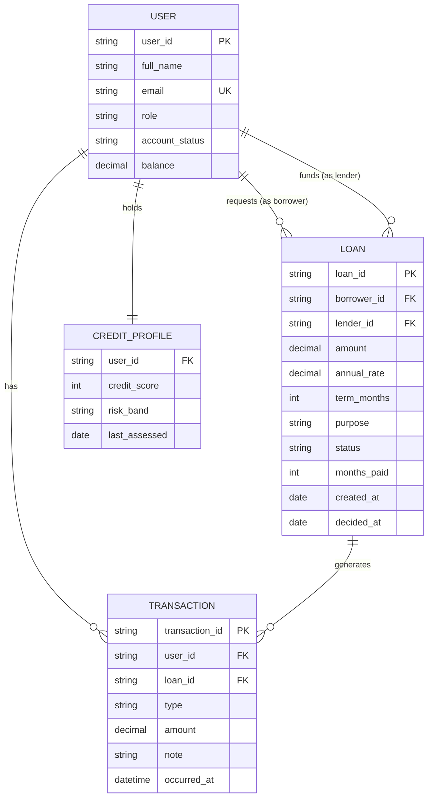
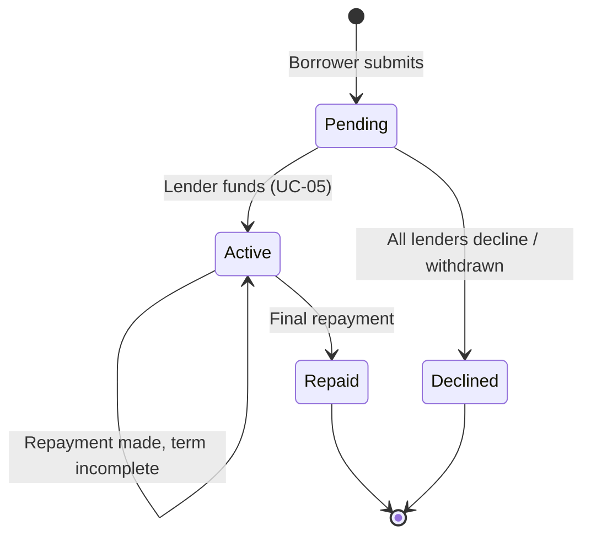

# 8. Data Model & Dictionary

[← Portfolio index](../README.md)

A conceptual data model produced during analysis to expose relationships and cardinality that prose requirements hide. Modelling the data revealed the single-lender constraint (BR-05) as a structural decision rather than an incidental one.

## Entity relationship diagram

## Data dictionary — selected attributes

| Entity | Attribute | Type | Rules | Notes |
|---|---|---|---|---|
| USER | email | String(255) | Unique, valid format | Login identifier |
| USER | role | Enum | borrower / lender / admin | Determines accessible functions |
| USER | account_status | Enum | pending / approved / declined / suspended | Governed by BR-01, BR-07 |
| USER | balance | Decimal(15,2) | ≥ 0 | Never negative — enforced by BR-04 |
| CREDIT_PROFILE | credit_score | Integer | 300–850 | Drives BR-06 |
| LOAN | amount | Decimal(15,2) | ₦10,000 – ₦10,000,000 | BR-02 |
| LOAN | lender_id | FK, nullable | Null while pending | Nullable is significant — see note |
| LOAN | status | Enum | pending / active / declined / repaid | State machine below |
| LOAN | annual_rate | Decimal(5,2) | Set at creation from BR-06 | Fixed for the life of the loan |
| TRANSACTION | type | Enum | loan_received / loan_funded / repayment / repayment_received | Both sides of every movement |
| TRANSACTION | amount | Decimal(15,2) | Signed | Negative = outflow from that user |

## Loan state machine

## Modelling observations

**`lender_id` is nullable.** A loan exists before it has a lender — this is not an oversight but the structural expression of the marketplace model. The application must therefore handle "a loan with no lender" as a valid state everywhere it touches loan data.

**One USER relates to LOAN through two distinct roles.** The same person could in principle be a borrower on one loan and a lender on another. The model permits this; the business has not yet decided whether to allow it. **Raised as an open question** rather than silently assumed either way — this is exactly the kind of gap data modelling surfaces and prose requirements do not.

**TRANSACTION is double-entry by design.** Every movement writes two rows, one per party. This satisfies NFR-07 and Compliance's audit requirement (STK-09), and makes reconciliation possible.
