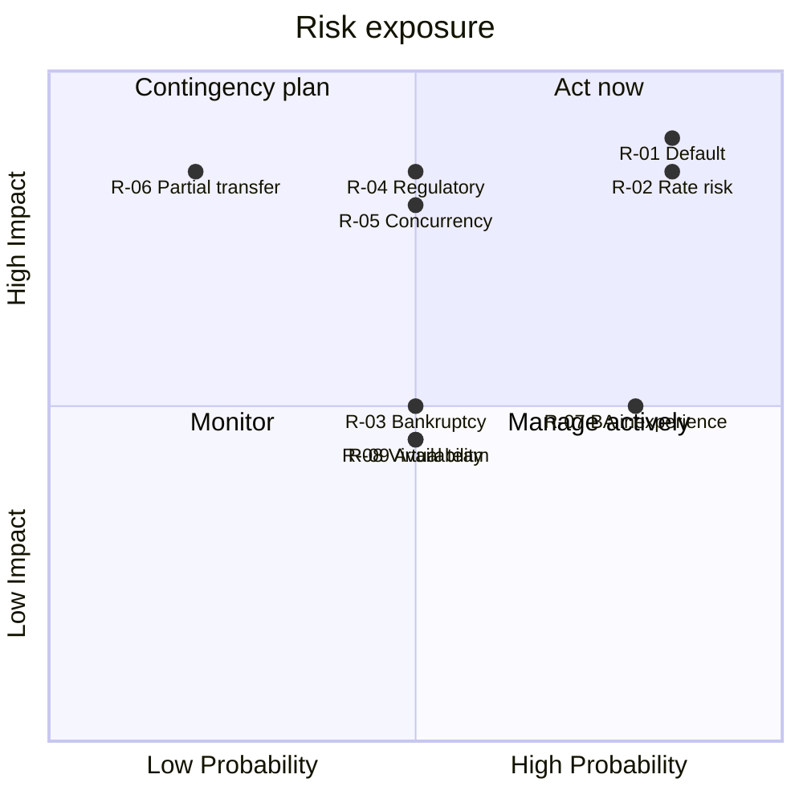

# 9. RAID Log

[← Portfolio index](../README.md)

Risks, Assumptions, Issues, and Dependencies. A RAID log is only useful if it is honest and owned — entries without a named owner and a next action are decoration.

## Risks

| ID | Risk | Prob. | Impact | Score | Response | Mitigation | Owner |
|---|---|---|---|---|---|---|---|
| R-01 | Borrowers default on repayment (credit risk) | High | High | **9** | Reduce | Credit scoring at registration; risk-based pricing; lender sees score before committing | Risk |
| R-02 | Interest rate movements make platform rates uncompetitive | High | High | **9** | Accept/Monitor | Rates fixed at origination protect existing contracts; review rate card quarterly | Sponsor |
| R-03 | Borrower bankruptcy — principal unrecoverable | Medium | Medium | 4 | Transfer | Out-of-scope for MVP; requires legal recovery process and possible insurance | Sponsor |
| R-04 | Regulatory position on P2P lending changes mid-delivery | Medium | High | **6** | Reduce | Compliance engaged before design; architecture keeps rules configurable | Compliance |
| R-05 | Concurrency — two lenders fund the same request | Medium | High | **6** | Reduce | Status validated at commitment, not display (UC-05 E2) | Dev Lead |
| R-06 | Partial transfer leaves funds in neither account | Low | High | 3 | Reduce | Atomic transaction requirement NFR-05; tested explicitly | Dev Lead |
| R-07 | Team inexperience in the BA role slows requirement quality | High | Medium | **6** | Reduce | Templates, peer review of artifacts, sponsor walkthroughs | PM |
| R-08 | Distributed team, virtual-only meetings weaken shared understanding | Medium | Medium | 4 | Reduce | Visual models over prose; recorded walkthroughs | PM |
| R-09 | Limited stakeholder availability delays validation | Medium | Medium | 4 | Reduce | Book validation sessions at project start, not when needed | PM |

*Score = probability × impact, each rated 1 (low) to 3 (high).*

## Assumptions

| ID | Assumption | If false | Validated |
|---|---|---|---|
| A-01 | Funding is available for the full delivery | Scope must be cut to MVP core | Sponsor confirmed |
| A-02 | Development team has the required technical skills | Training or contractors needed | Confirmed |
| A-03 | Credit bureau data obtainable under a permissioned interface | Scoring must be built from internal behaviour only | **Open — needs confirmation** |
| A-04 | Regulatory environment stable through delivery | Rework of compliance-touching features | Monitored (R-04) |
| A-05 | Infrastructure adequate for expected load | Performance NFR-08 at risk | Not yet tested |

**A-03 is the assumption carrying the most unexamined risk.** The entire risk-based pricing model (BR-06) depends on credit scores being obtainable. If bureau access is refused or too costly, scoring must be rebuilt from internal repayment behaviour only — which does not work for new users, undermining FR-03, FR-04, and the lender's core need STK-04. This should be confirmed before build, not during.

## Issues

| ID | Issue | Raised | Impact | Resolution | Status |
|---|---|---|---|---|---|
| I-01 | "Approval" used to mean two different decisions by different stakeholders | Workshop | Requirement ambiguity | Split into account approval (UC-04) and loan funding (UC-05) | Closed |
| I-02 | Stakeholders requested full financial disclosure to lenders | Interview | NDPR exposure | Credit score satisfies underlying need at lower risk | Closed |
| I-03 | Whether one user may act as both borrower and lender is undecided | Data modelling | Affects model and access rules | Escalated to Sponsor | **Open** |
| I-04 | Arrears and missed-payment handling not defined | Business rules | BR-10 incomplete | Deferred with scope decision recorded | Deferred |

## Dependencies

| ID | Dependency | Type | Needed by | Risk if late |
|---|---|---|---|---|
| D-01 | Credit bureau interface agreement | External | Design | Blocks FR-03 (links to A-03) |
| D-02 | Banking partner settlement integration | External | Build | Blocks real fund movement |
| D-03 | Compliance sign-off on data handling | Internal | Design | Rework of user data features |
| D-04 | UAT environment provisioned | Internal | Test | Delays validation |
| D-05 | Administrator availability for training | Internal | Go-live | Delays cutover |
