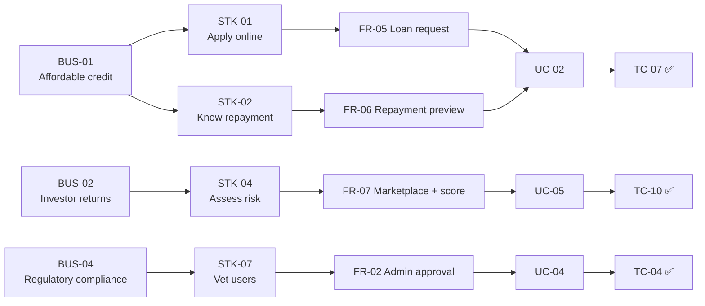

# 10. Requirements Traceability Matrix

[← Portfolio index](../README.md)

Traceability answers two questions an auditor, sponsor, or test manager will eventually ask: *is every business need actually delivered?* and *is anything being built that no one asked for?*

Reading **left to right** proves coverage. Reading **right to left** exposes orphans — code or tests that trace to no requirement.

## Forward trace: business need → test

| Business req | Stakeholder req | Solution req | Use case | Business rule | Test case | Status |
|---|---|---|---|---|---|---|
| BUS-01 | STK-01 | FR-01, FR-05 | UC-01, UC-02 | BR-02, BR-03 | TC-01, TC-07, TC-08 | ✅ Passed |
| BUS-01 | STK-02 | FR-06 | UC-02 | BR-09 | TC-07 | ✅ Passed |
| BUS-01 | STK-03 | FR-04 | UC-02 | BR-06 | TC-07 | ✅ Passed |
| BUS-02 | STK-04 | FR-03, FR-07 | UC-05, UC-09 | BR-06 | TC-09 | ✅ Passed |
| BUS-02 | STK-04 | FR-08, FR-10 | UC-05 | BR-04, BR-05 | TC-10, TC-11 | ✅ Passed |
| BUS-02 | STK-05 | FR-09 | UC-06 | — | TC-12 | ✅ Passed |
| BUS-02 | STK-06 | FR-13 | — | — | TC-15 | ✅ Passed |
| BUS-03 | STK-01 | FR-05, FR-07 | UC-02, UC-05 | — | TC-07, TC-09 | ✅ Passed |
| BUS-04 | STK-07 | FR-02, FR-15 | UC-04 | BR-01, BR-08 | TC-04, TC-16 | ✅ Passed |
| BUS-04 | STK-08 | FR-14 | UC-07 | BR-07 | TC-17 | ✅ Passed |
| BUS-04 | — | NFR-04 | — | BR-08 | TC-18, TC-19 | ✅ Passed |
| BUS-04 | STK-09 | NFR-06 | — | — | Design review | ✅ Approved |
| BUS-05 | STK-09 | FR-10, NFR-07 | UC-05 | BR-11 | TC-15 | ✅ Passed |
| BUS-05 | STK-10 | FR-16 | UC-08 | BR-11 | TC-15 | ✅ Passed |
| BUS-01 | STK-03 | FR-12 | UC-03 | BR-10 | TC-14 | ✅ Passed |
| BUS-01 | STK-01 | FR-11 | UC-03 | BR-09 | TC-13 | ✅ Passed |

## Traceability diagram

## Coverage analysis

| Check | Result |
|---|---|
| Business requirements with delivered solution coverage | 5 of 5 ✅ |
| Solution requirements (Must priority) with a test case | 14 of 14 ✅ |
| Requirements with no test case | 0 ✅ |
| Test cases tracing to no requirement (orphans) | 0 ✅ |
| Deferred requirements, recorded with rationale | FR-17, FR-18 |

## Backward trace: notable checks

**Every "Must" requirement has at least one test case.** FR-13 (portfolio view) is a "Should" and is covered by TC-15.

**No orphan tests.** Each of the 22 UAT cases traces to a requirement — nothing was tested that nobody asked for, and nothing was built speculatively.

**FR-17 (messaging) and FR-18 (bank linking) trace to no test** because they are explicitly out of scope for this release. They remain in the matrix rather than being deleted, so the deferral is visible to anyone reviewing coverage rather than looking like an omission.

→ Test cases and results: [UAT Test Cases](11-uat-test-cases.md)
